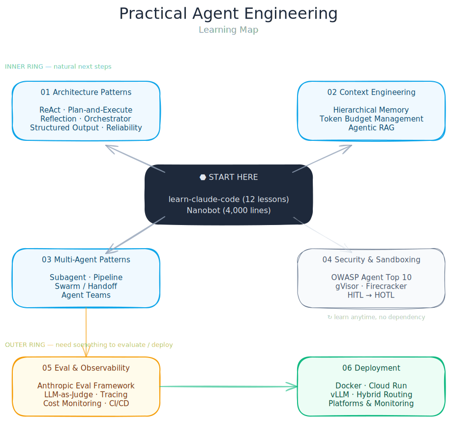

# Practical Agent Engineering

> 一份有观点、有结构的 AI Agent 工程师学习路径（2026）。
> 不是链接合集，是有学习顺序、实战计划和真实建议的指南。

**[English](README.md) | 中文**

## 为什么做这份指南

大部分 "awesome" 列表给你 200 个链接，没有方向。这份指南给你的是：
- **学习路径** — 先学什么、后学什么
- **有观点的推荐** — 不列所有工具，只选真正好用的
- **实战计划** — 每个模块都有具体练习，不只是阅读清单
- **架构优先** — 先理解模式，再碰框架

## 学习地图

  

## 学习策略

**先通过一个完整项目建立全局认知，再按方向深入。**

### 第一步：从零搭一个 Agent（3-4 周）

两个项目，一口气把基础全过一遍：

| 项目 | 你会学到 | 时间 |
|------|---------|------|
| [learn-claude-code](https://github.com/shareAI-lab/learn-claude-code) | 12 节课：agent loop、工具调用、context、subagent、团队协作、权限 | 2-3 周 |
| [Nanobot](https://github.com/HKUDS/nanobot) | 4,000 行代码读完一个完整 Agent：记忆、工具、多模型支持 | 2-3 天 |

### 第二步：各方向深入

| # | 方向 | 主干项目覆盖了？ | 需要额外深入 | 详情 |
|---|------|-----------------|------------|------|
| 1 | 架构模式 | Agent Loop 基础 | ReAct vs Plan-Execute、结构化输出、可靠性 | [中文](docs/zh/01-architecture-patterns.md) · [EN](docs/01-architecture-patterns.md) |
| 2 | Context Engineering | Context 隔离 | 分层记忆、token 预算、Agentic RAG | [中文](docs/zh/02-context-engineering.md) · [EN](docs/02-context-engineering.md) |
| 3 | 多 Agent 模式 | Subagent、Teams | Pipeline/LangGraph、Swarm/Handoff | [中文](docs/zh/03-multi-agent-patterns.md) · [EN](docs/03-multi-agent-patterns.md) |
| 4 | 安全与沙箱 | 权限治理 | Firecracker/gVisor、OWASP、HITL → HOTL | [中文](docs/zh/04-security-sandbox.md) · [EN](docs/04-security-sandbox.md) |
| 5 | 评估与可观测 | 未覆盖 | Evals、LLM-as-Judge、追踪、成本监控 | [中文](docs/zh/05-eval-and-observability.md) · [EN](docs/05-eval-and-observability.md) |
| 6 | 部署 | 未覆盖 | Docker、平台选型、vLLM、混合路由 | [中文](docs/zh/06-deployment.md) · [EN](docs/06-deployment.md) |

### 框架速查

| 框架 | 用途 | 文档 |
|------|------|------|
| [Claude Agent SDK](https://platform.claude.com/docs/en/agent-sdk/overview) | Agent 实现、沙箱执行 | [TS](https://github.com/anthropics/claude-agent-sdk-typescript) / [Python](https://github.com/anthropics/claude-agent-sdk-python) |
| [LangGraph](https://langchain-ai.github.io/langgraph/) | 有状态多 Agent 编排 | [教程](https://langchain-ai.github.io/langgraph/tutorials/) |
| [OpenAI Agents SDK](https://openai.github.io/openai-agents-python/) | 快速原型、Swarm/Handoff | [GitHub](https://github.com/openai/openai-agents-python) |
| [Langfuse](https://langfuse.com) | 评估 + 可观测（开源） | [文档](https://langfuse.com/docs) |
| [DeepEval](https://deepeval.com) | 本地评估 + CI/CD | [文档](https://docs.confident-ai.com/) |

## 时间线

| 月份 | 在做什么 | 产出 |
|------|---------|------|
| **1-2** | learn-claude-code + Nanobot | 理解 Agent 内部原理 |
| **2-3** | 架构深入 + LangGraph | 第一个多 Agent pipeline |
| **3-4** | 安全 + 评估 | 沙箱、权限模型、自动化评估 |
| **5-6** | 部署 + 可观测 | 一个部署上线的 Agent，带监控和成本追踪 |

## 适合谁

- 想转 AI/Agent 方向的软件工程师
- 用过 AI 编程工具（Claude Code、Cursor、Copilot）想搞懂它们怎么工作的开发者
- 想做生产级 Agent 而不只是 demo 的工程师

## 贡献

欢迎提 PR：修过期链接、补充资源、改善表述。详见 [CONTRIBUTING.md](CONTRIBUTING.md)。

## 许可证

[MIT](LICENSE)
